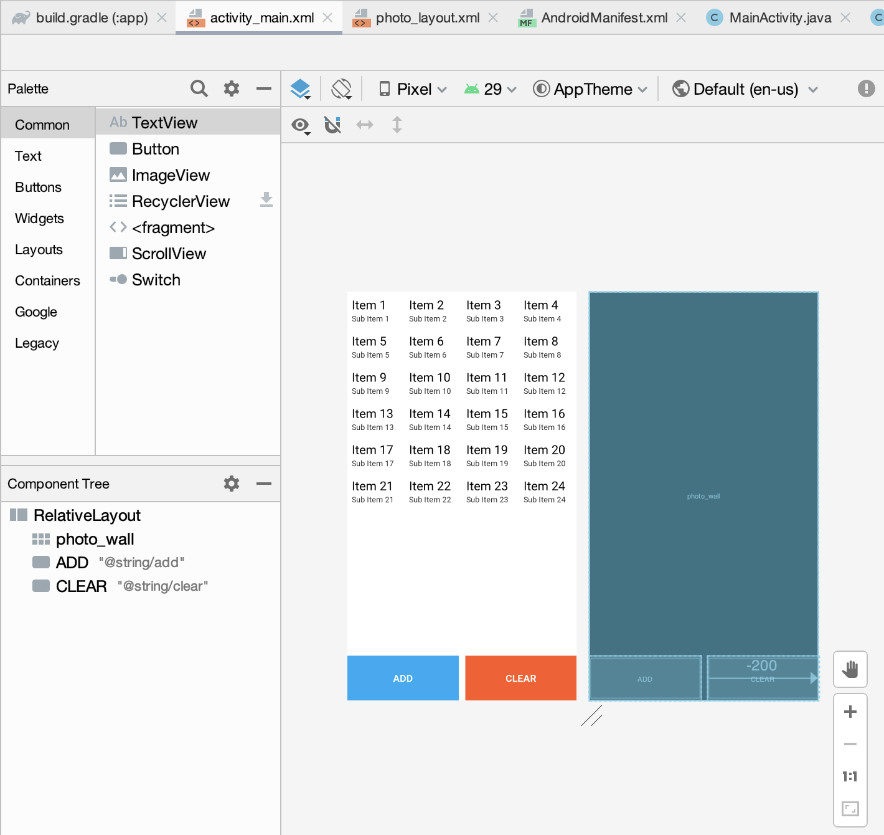
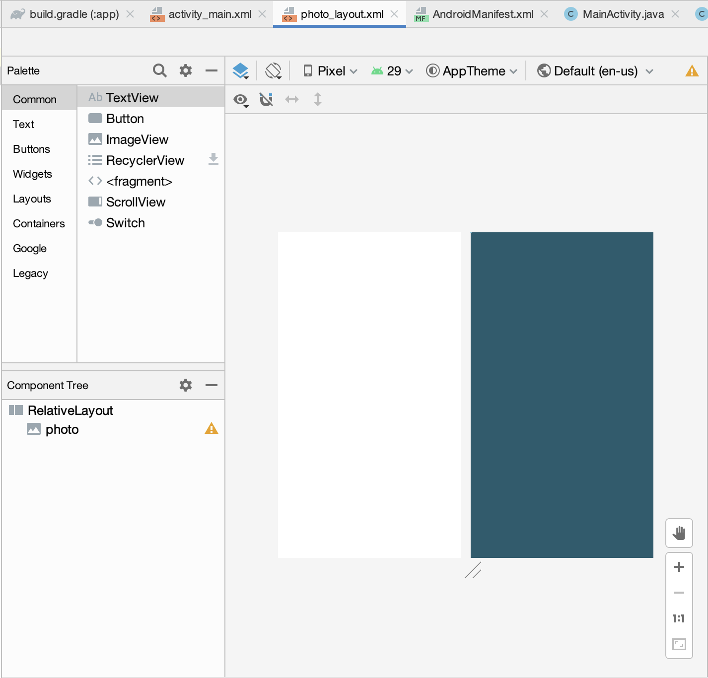
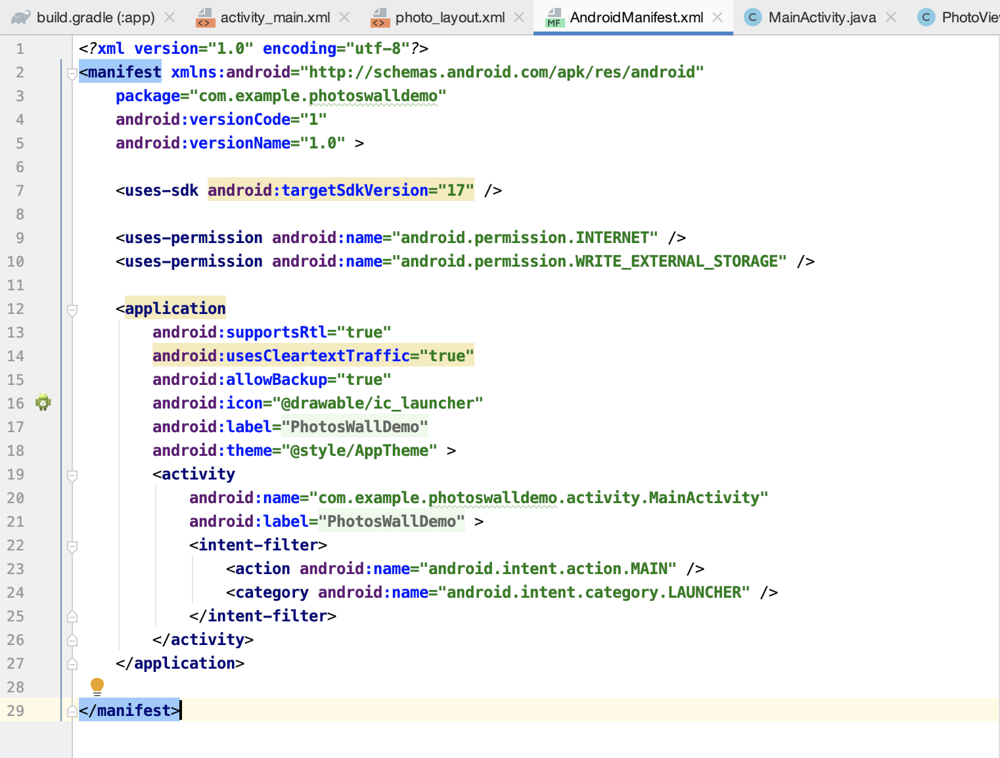
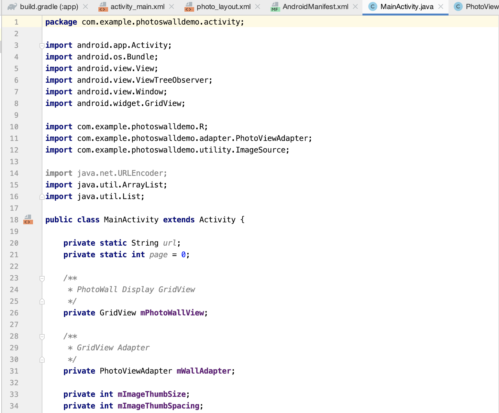
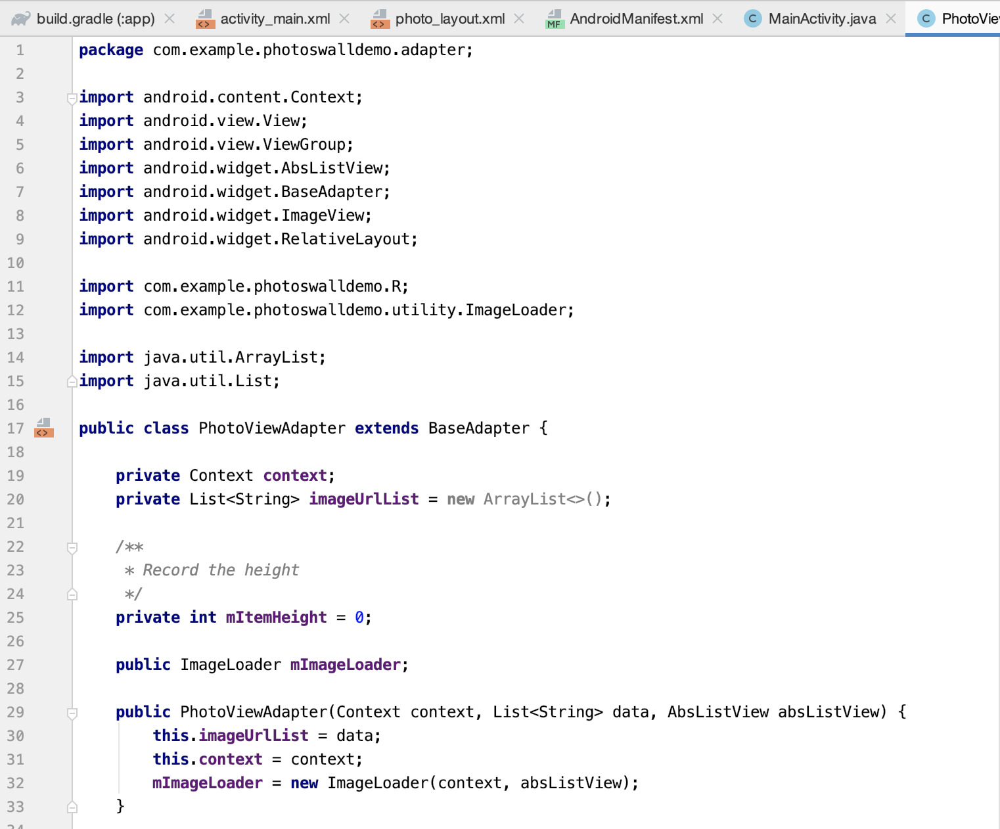

# PhotoView

**PhotoView:** 在线图片的加载DEMO

**格式布局:** 4 * N

**功能:** ADD: 加载图片；CLEAR: 删除现有显示图片

​          对于不同尺寸的图片，进行缩放并且截取正中间位置进行显示，不会对图片进行拉伸压缩处理，方便预览

**预览:** 

**PhotoView组成部分：** 

**1. activity_main.xml** 用来设计图片加载demo的基本布局：

每页显示24个item，设置有两个按键：ADD和CLEAR；

**2.photo_layout_xml:**

显示app的基本布局；

**3.AndroidManifest.xml:**

**4.MainActivity.java:**

**5.PhotoViewAdapter.java:**

**在线加载图片工具：**

DownloadImageListUtil

DiskLruCacheUtil

mageLoader
